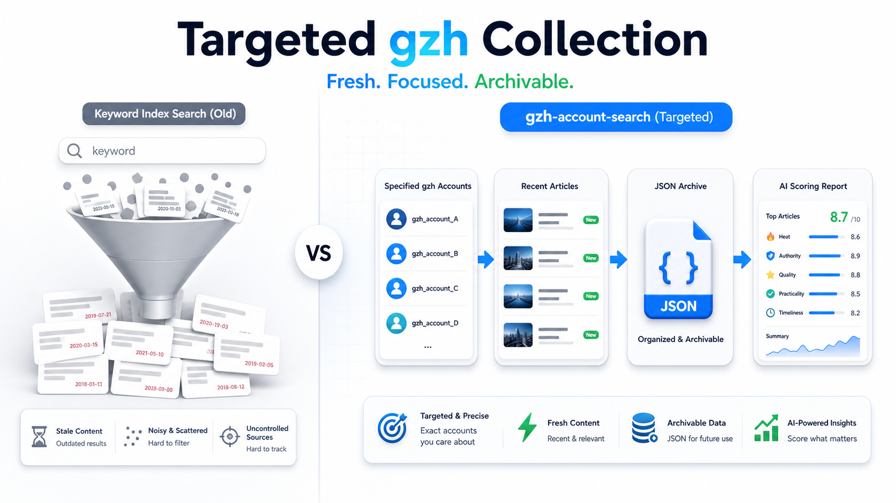

# gzh-account-search



**指定微信公众号账号采集工具。**

给它一组目标公众号，它会登录微信公众平台后台，按账号采集近期或历史文章，保存原始 JSON，并可选调用 OpenAI 兼容模型做五维评分，最后生成 Markdown 报告。

> 这不是关键词泛搜工具，也不依赖 Sogou 等公开索引。它解决的是“我已经知道要跟踪哪些账号，想稳定拉取这些账号内容”的场景。

## 适合做什么

- **竞品日报/周报**：固定账号列表，抓取最近发布内容。
- **行业账号监控**：按 `lookback_days` 控制时间窗口，持续归档。
- **历史内容整理**：调大时间窗口和单账号数量，分批归档旧文章。
- **内容筛选**：启用 AI 评分后，按热度、权威性、质量、实用性、时效性排序输出。

## 功能概览

| 能力 | 说明 |
| --- | --- |
| **定点采集** | 配置目标公众号列表，不靠关键词碰运气 |
| **时间窗口** | 用 `lookback_days` 控制抓取最近几天的文章 |
| **数量限制** | 用 `max_articles_per_account` 控制每个账号最多采多少篇 |
| **原始归档** | 按日期和账号保存 JSON，便于复盘、入库或二次分析 |
| **AI 评分** | 支持 OpenAI 兼容接口，可关闭 |
| **节奏控制** | 可调整点击、翻页、文章和账号间隔，降低页面不稳定影响 |

## 快速开始

```bash
git clone https://github.com/NeAoo/gzh-account-search.git
cd gzh-account-search

python -m venv .venv
source .venv/bin/activate
pip install -r requirements.txt
playwright install chromium

cp config.yaml.example config.yaml
```

Windows PowerShell:

```powershell
python -m venv .venv
.venv\Scripts\Activate.ps1
pip install -r requirements.txt
playwright install chromium
copy config.yaml.example config.yaml
```

编辑 `config.yaml`，先填目标账号：

```yaml
fetch:
  accounts:
    - "目标公众号A"
    - "目标公众号B"
  lookback_days: 7
  max_articles_per_account: 10
```

第一次建议先关闭评分，只验证采集链路：

```yaml
scoring:
  enabled: false
```

运行：

```bash
python main.py --config config.yaml
```

首次运行会打开浏览器，需要扫码登录微信公众平台。登录态默认保存到 `browser_data/`，后续 `browser_mode: auto` 会优先复用。

## 启用 AI 评分

如果要生成带评分的精选报告，填写 OpenAI 兼容接口配置：

```yaml
llm:
  api_key: "sk-..."
  base_url: "https://api.openai.com/v1"
  model: "gpt-4o-mini"
  workers: 5

scoring:
  enabled: true
  prompt_file: "prompts/scoring.txt"
```

评分结果会保留这些字段：

```text
heat, authority, quality, practicality, timeliness, overall, reason
```

## 常用配置例子

**竞品日报**

```yaml
fetch:
  accounts:
    - "竞品A"
    - "竞品B"
    - "竞品C"
  lookback_days: 1
  max_articles_per_account: 10
  fetch_full_content: true

scoring:
  enabled: true

output:
  filename_pattern: "竞品公众号日报_{date}.md"
```

**历史归档**

```yaml
fetch:
  accounts:
    - "目标账号A"
  lookback_days: 365
  max_articles_per_account: 100
  fetch_full_content: true

scoring:
  enabled: false
```

**只抓标题和链接**

```yaml
fetch:
  accounts:
    - "目标账号A"
    - "目标账号B"
  fetch_full_content: false

scoring:
  enabled: false
```

## 输出文件

```text
output/
└── gzh日报_20260501.md

raw_data/
└── gzh/
    └── 2026-05-01/
        ├── 目标账号A/
        │   └── articles_20260501_120000.json
        └── all_accounts_20260501_120000.json
```

- `output/`：最终 Markdown 报告。
- `raw_data/`：原始采集结果，按日期和账号归档。
- `logs/`：运行日志。
- `browser_data/`：浏览器登录态。

## 采集稳定性

微信公众平台后台页面会有加载延迟。如果账号多、页面慢、容易点不到元素，优先调大这些值：

```yaml
fetch:
  slow_mo_ms: 300
  action_delay_seconds: 1.5
  article_delay_seconds: 3.0
  page_delay_seconds: 4.0
  account_delay_seconds: 8.0
```

## 自定义

- 评分提示词：`prompts/scoring.txt`
- 评分报告模板：`templates/report.md.j2`
- 不评分报告模板：`templates/report_no_score.md.j2`
- 配置样例：`config.yaml.example`

## 测试

```bash
python -m pytest -v
```

## 注意事项

- 采集依赖微信公众平台后台页面，页面结构变化可能导致选择器失效。
- 请控制采集频率，遵守目标平台规则和账号权限边界。
- 使用本工具产生的任何后果由使用者自行承担。

## License

MIT License.
