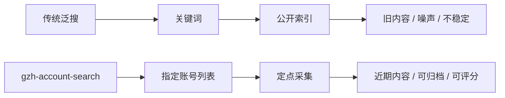
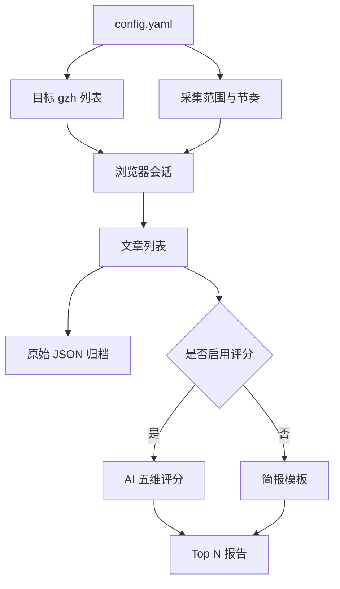
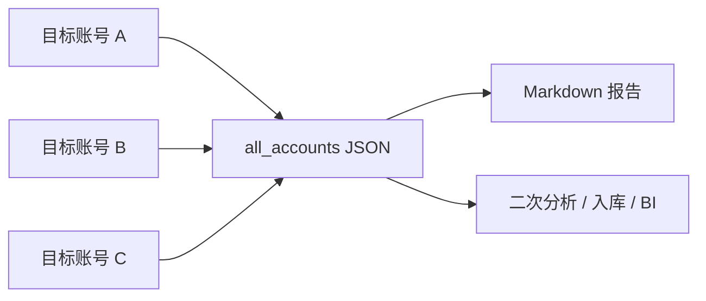

# gzh-account-search

指定 gzh 账号定点采集工具。它不是关键词泛搜，不依赖 Sogou 式公开索引，而是围绕你给定的目标账号列表，按时间窗口稳定拉取文章，并可选用 AI 做通用五维评分，最后输出 Markdown 报告和原始 JSON。

> **定位一句话:** 市面上很多工具走的是 Sogou 式泛搜入口，索引慢、内容旧、结果不可控；`gzh-account-search` 面向“我已经知道要跟踪哪些账号”的场景，专注定点、批量、可复用地采集目标 gzh。

> **使用前提与风险:** 本工具需要你有可登录的 gzh 后台权限。请控制频率，遵守平台规则和内容版权要求。大规模、高频操作可能触发风控，所有使用后果由使用者自行承担。

## 为什么需要它

很多内容采集方案的核心问题不是“能不能搜到”，而是“搜到的是不是你真正要跟踪的账号、是不是足够新、是不是能持续稳定复用”。

| 方案 | 适合什么 | 主要问题 |
|---|---|---|
| Sogou 式泛搜 | 临时按关键词找一点结果 | 索引滞后，老内容多，目标账号不可控 |
| 普通搜索引擎 | 偶尔查公开网页 | 命中不稳定，重复和无关结果多 |
| `gzh-account-search` | 按指定账号持续采集 | 需要你有可登录的 gzh 环境 |



## 核心能力

- **定点账号采集:** 直接配置目标 gzh 名称列表，不靠关键词碰运气。
- **新内容优先:** 用 `lookback_days` 控制时间范围，适合日报、周报、竞品监控。
- **可尽量扫全:** 把 `lookback_days` 和 `max_articles_per_account` 调大后，可沿目标账号历史列表持续翻页，在页面允许范围内尽可能采集全部可见内容。
- **AI 五维评分:** 热度、权威性、内容质量、实用性、时效性，提示词可改。
- **两种输出:** 打分报告和不打分简报都支持 Markdown 模板自定义。
- **节奏控制:** 内置操作间隔、翻页间隔、账号间隔，减少页面不稳定和风控风险。
- **原始数据归档:** 每次运行按日期和账号保存 JSON，方便二次处理。



## 本地测试运行哪个脚本

入口脚本就是根目录的 `main.py`。

最小流程:

```bash
cp config.yaml.example config.yaml
```

编辑 `config.yaml`，至少改这两处:

```yaml
fetch:
  accounts:
    - "目标gzh账号A"
    - "目标gzh账号B"

scoring:
  enabled: false
```

第一次本地测试建议先关闭评分，确认采集链路没问题:

```bash
python main.py --config config.yaml
```

如果你想启用 AI 评分，再填写:

```yaml
llm:
  api_key: "sk-..."
  base_url: "https://api.openai.com/v1"
  model: "gpt-4o-mini"

scoring:
  enabled: true
```

然后再次运行:

```bash
python main.py --config config.yaml
```

## 快速开始

```bash
git clone https://github.com/NeAoo/gzh-account-search.git
cd gzh-account-search

python -m venv .venv
source .venv/bin/activate
pip install -r requirements.txt
playwright install chromium

cp config.yaml.example config.yaml
python main.py --config config.yaml
```

Windows PowerShell:

```powershell
python -m venv .venv
.venv\Scripts\Activate.ps1
pip install -r requirements.txt
playwright install chromium
python main.py --config config.yaml
```

首次运行会打开可见浏览器，需要完成登录。登录态会保存到 `browser_data/`，后续 `fetch.browser_mode: auto` 会优先尝试无界面复用。

## 示例场景

### 竞品账号日报

```yaml
fetch:
  accounts:
    - "竞品A"
    - "竞品B"
    - "竞品C"
  lookback_days: 1
  max_articles_per_account: 10

scoring:
  enabled: true

output:
  filename_pattern: "竞品gzh日报_{date}.md"
```

适合每天固定采集目标账号的新内容，AI 自动筛出最值得看的 Top N。

### 指定账号历史归档

```yaml
fetch:
  accounts:
    - "目标账号A"
  lookback_days: 365
  max_articles_per_account: 200
  fetch_full_content: true

scoring:
  enabled: false
```

适合对单个目标账号做历史内容归档。实际可采范围取决于页面可见历史列表和账号状态。

### 只要链接和标题，不抓全文

```yaml
fetch:
  accounts:
    - "目标账号A"
    - "目标账号B"
  fetch_full_content: false

scoring:
  enabled: false
```

速度更快，更适合先跑通流程或做轻量监控。

## 配置重点

### 采集范围

```yaml
fetch:
  accounts:
    - "目标gzh账号A"
  max_articles_per_account: 10
  lookback_days: 7
  fetch_full_content: true
```

### 浏览器模式

```yaml
fetch:
  browser_mode: "auto"
  login_timeout_seconds: 180
```

- `auto`: 推荐。没有登录态时可见登录，有登录态后优先无界面运行。
- `visible`: 始终可见，适合调试。
- `headless`: 始终无界面，适合确认登录态有效后的服务器环境。

### 节奏控制

```yaml
fetch:
  slow_mo_ms: 300
  action_delay_seconds: 1.5
  article_delay_seconds: 3.0
  page_delay_seconds: 4.0
  account_delay_seconds: 8.0
```

页面不稳定、目标账号多、或者采集范围大时，优先调大这些值。

## 输出结果

```text
output/
└── gzh日报_20260501.md

raw_data/
└── gzh/
    └── 2026-05-01/
        ├── 目标账号A/
        │   └── articles_20260501_120000.json
        └── all_accounts_20260501_120000.json
```



## 自定义 AI 评分

编辑 `prompts/scoring.txt` 可以调整说明和权重。代码读取以下 JSON key，请保留:

- `heat`
- `authority`
- `quality`
- `practicality`
- `timeliness`
- `overall`
- `reason`

## 自定义报告

编辑:

- `templates/report.md.j2`: 评分模式
- `templates/report_no_score.md.j2`: 不评分模式

模板可访问:

- `articles`
- `generated_at`
- `max_score`
- `avg_score`

## 作为库使用

```python
from pathlib import Path

from gzh_account_search import Config, Pipeline

config = Config.from_yaml(Path("config.yaml"))
output_file = Pipeline(config).run()
print(output_file)
```

## 常见问题

**Q: 本地测试先跑什么？**

先设置 `scoring.enabled: false`，然后运行:

```bash
python main.py --config config.yaml
```

**Q: 为什么强调定点采集？**

因为泛搜工具通常依赖公开索引，内容更新慢，目标账号不可控。这个项目的核心是你明确给出账号列表，工具按列表逐个采集，更适合监控、归档和竞品追踪。

**Q: 能不能采集历史内容？**

可以把 `lookback_days` 和 `max_articles_per_account` 调大，让工具沿目标账号列表持续翻页，在页面允许范围内尽可能采集可见历史内容。

**Q: 运行报 `api_key` 错误？**

你启用了 `scoring.enabled: true`，但没有填写 `llm.api_key`。填写 key，或关闭评分。

## 测试

```bash
python -m pytest -v
```

## License

MIT License. 使用本工具产生的任何后果由使用者自行承担。
